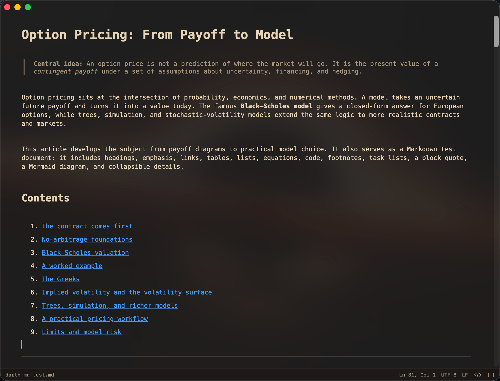

# DarthScriptum



A lightweight, performance-first Markdown editor for macOS.

## Build from source

Requires macOS 14 or later and Xcode with Swift 6 support.

```sh
./scripts/build-debug.sh
open DerivedData/Build/Products/Debug/DarthScriptum.app
```

## License

DarthScriptum is available under the [MIT License](LICENSE). Third-party
components retain their respective terms; see
[Third-Party Notices](THIRD_PARTY_NOTICES.md).
